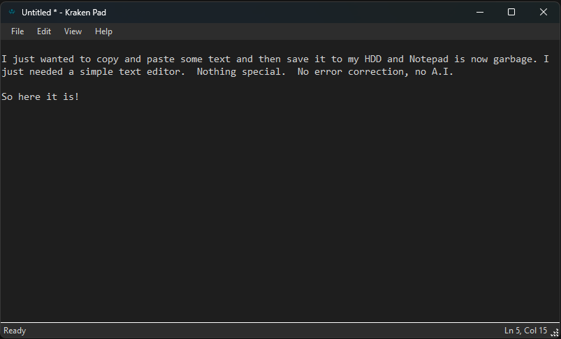

# Kraken Pad

A fast, simple text editor for Windows. No bloat, no AI, just text.



## Features

- **Fast** - Native Windows app, instant startup
- **Simple** - Just the basics: New, Open, Save, Find/Replace
- **Dark/Light theme** - Automatically matches your Windows theme
- **Lightweight** - ~200KB (requires .NET 8 runtime)
- **Keyboard shortcuts** - All the standards work (Ctrl+S, Ctrl+F, etc.)
- **Drag & drop** - Drop files onto the window to open them
- **File associations** - Can be set as default for .txt files

## Keyboard Shortcuts

| Shortcut | Action |
|----------|--------|
| Ctrl+N | New file |
| Ctrl+O | Open file |
| Ctrl+S | Save |
| Ctrl+Shift+S | Save As |
| Ctrl+Z | Undo |
| Ctrl+X | Cut |
| Ctrl+C | Copy |
| Ctrl+V | Paste |
| Ctrl+A | Select All |
| Ctrl+F | Find |
| Ctrl+H | Replace |
| Ctrl+G | Go to Line |

## Installation

### Option 1: Download the Installer
Download `KrakenPad_Setup.exe` from the [Releases](../../releases) page and run it.

The installer will:
- Install Kraken Pad to your chosen location
- Create Start Menu and Desktop shortcuts (optional)
- Register file associations (optional)
- Show up in Windows "Default apps" settings

### Option 2: Build from Source
Requires [.NET 8 SDK](https://dotnet.microsoft.com/download/dotnet/8.0)

```bash
# Clone the repo
git clone https://github.com/YOUR_USERNAME/Kraken-Pad.git
cd Kraken-Pad

# Build the app
dotnet build -c Release

# Or publish for distribution
dotnet publish -c Release -o publish
```

### Building the Installer
```bash
cd Installer
dotnet publish -c Release -r win-x64 --self-contained true -o ../installer_output
```

## Why?

Microsoft decided to turn Notepad into a bloated "modern" app with AI features. Some of us just want to quickly edit a text file without waiting for it to load, without AI suggestions, without cloud sync.

Kraken Pad is what Notepad should have stayed: fast, simple, and focused.

## License

MIT License - do whatever you want with it.
